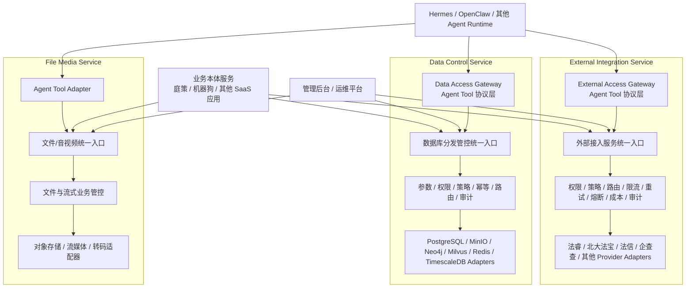

# Unified Resource Services

统一资源服务平台（`unified-resource-services`）是一个 **Monorepo**，用于存放、开发和联调三个能够独立构建、独立发布、独立部署、独立扩缩容的完整微服务：

1. `file-media-service`：文件、音频、视频与流式会话的完整服务；
2. `data-control-service`：数据库分发、租户业务路由、安全管控与审计的完整服务；
3. `external-integration-service`：第三方能力接入、供应商治理、成本控制与审计的完整服务。

> 这三个服务不是“给 Agent 接入的三个小接口”。Agent Tool 接口只是每个完整服务可提供的一种调用适配层；业务服务、管理后台和内部服务也可以通过各自的正式接口调用它们。

当前仓库处于 **公共骨架和架构约束初始化阶段**。服务业务实现将按垂直切片逐步补充。

## 1. 总体架构



### 两类调用路径

Agent 调用数据服务：

```text
Agent → Data Access Gateway → 数据库分发管控服务统一入口 → Adapter → 真实数据资源
```

业务服务调用数据服务：

```text
业务本体服务 → 数据库分发管控服务统一入口 → Adapter → 真实数据资源
```

外部接入服务采用相同原则：`External Access Gateway` 位于上层，只负责 Agent Tool 协议适配；真正的权限、策略、幂等、Provider 路由和调用治理集中在“外部接入服务统一入口”。

## 2. 三个服务的职责

| 服务 | 完整职责 | 独立部署单元 |
|---|---|---|
| `file-media-service` | 文件上传下载、分片、对象元数据、预签名 URL、音视频流接入与转发、转码、租户业务隔离、安全策略和审计 | 是 |
| `data-control-service` | Data Access Gateway、统一数据入口、租户优先/业务次级分库、数据权限、策略、幂等、路由、事务、备份与审计 | 是 |
| `external-integration-service` | External Access Gateway、统一外部入口、Provider 注册与路由、凭据、限流、超时、重试、熔断、成本与调用审计 | 是 |

## 3. Monorepo 不等于分布式单体

本仓库采用 Monorepo 便于统一契约、联调和 CI，但必须保持硬边界：

- 三个服务分别构建镜像、发布版本和执行数据库迁移；
- 服务之间禁止直接 `import` 对方 `src/`；
- 服务之间只能通过 HTTP、RPC、消息或正式客户端契约通信；
- 每个服务拥有自己的数据表、迁移、审计语义和故障边界；
- 一个服务的失败不得阻止另外两个服务独立启动；
- 根目录 `infra/` 只负责本地联调、公共网络和公共可观测性，不拥有服务业务迁移。

## 4. 公共包边界

只共享稳定、无业务状态、没有业务数据库所有权的代码。

当前最小公共包：

| 包 | 内容 | 禁止内容 |
|---|---|---|
| `@urs/contracts` | 通用上下文、响应、资源范围和审计事件的基础类型 | 服务内部 DTO、业务路由规则 |
| `@urs/common-errors` | 小而稳定的基础错误类型 | 案件、设备、Provider 等业务错误 |
| `@urs/capability-token-sdk` | Capability Claims 契约和强制 Scope 断言 | 租户业务权限数据库、服务策略实现 |
| `@urs/observability` | Trace/Request 上下文、结构化日志字段和脱敏工具 | 服务专属指标和告警规则 |
| `@urs/test-kit` | 租户隔离测试夹具、Canary 和测试上下文构造器 | 生产运行时代码 |

以下逻辑默认留在各自服务内部，不能为了“未来可能复用”提前抽象：

```text
auth 业务授权
policy 具体策略
resource ownership 资源归属
idempotency 业务幂等语义
audit 具体审计事件
routing 数据或 Provider 路由
repository / adapter / migrations
```

只有同时满足以下条件，代码才可以提取到 `packages/`：

1. 已被至少两个服务真实使用；
2. 不包含服务专属语义；
3. 不直接拥有业务数据库或外部资源；
4. 不迫使三个服务同步发布；
5. 有稳定 API、独立测试和版本约束。

## 5. 目录结构

```text
unified-resource-services/
├── services/
│   ├── file-media-service/
│   ├── data-control-service/
│   └── external-integration-service/
├── packages/
│   ├── contracts/
│   ├── common-errors/
│   ├── capability-token-sdk/
│   ├── observability/
│   └── test-kit/
├── infra/
│   ├── local/
│   ├── kubernetes/
│   └── monitoring/
├── docs/
├── scripts/
├── AGENTS.md
├── pnpm-workspace.yaml
├── tsconfig.base.json
└── package.json
```

每个服务自己的 `migrations/`、`openapi/`、`deploy/`、`Dockerfile` 和测试必须保留在服务目录内。

## 6. 建议开发顺序

不要先构建大而全的共享框架。推荐顺序：

1. 建立 Monorepo 和最小公共底座；
2. 在 `data-control-service` 跑通第一个 PostgreSQL 垂直切片；
3. 从真实重复中提取已验证公共代码；
4. 跑通 `external-integration-service` 的一个 Provider；
5. 修正公共抽象；
6. 跑通 `file-media-service` 的一个上传/下载链路；
7. 完成三服务独立构建、部署和联调。

`data-control-service` 的完整开发约束见：

- [`services/data-control-service/AGENTS.md`](services/data-control-service/AGENTS.md)
- [`services/data-control-service/VIBE_CODING.md`](services/data-control-service/VIBE_CODING.md)

## 7. 基础命令

```bash
corepack enable
pnpm install
pnpm lint
pnpm typecheck
pnpm build
pnpm test
```

单独构建服务：

```bash
pnpm --filter @urs/file-media-service build
pnpm --filter @urs/data-control-service build
pnpm --filter @urs/external-integration-service build
```

本地启动：

```bash
pnpm dev:file-media
pnpm dev:data-control
pnpm dev:external-integration
```

## 8. 状态说明

当前提交仅提供可持续演进的公共骨架、微服务边界和 Vibe Coding 护栏。健康检查启动文件是骨架代码，不代表三个服务的业务能力已经完成。