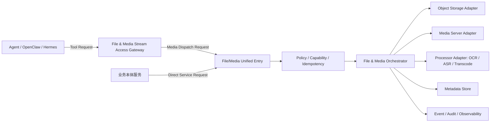

# 文件/音视频流式服务架构基线

本文件用于把用户提供的《文件/音视频访问服务》架构图与统一访问平面技术资料转化为可执行的开发边界。原始图仍是最高优先级事实源，本文不替代原图。

## 1. 在统一资源访问平面中的位置

统一资源访问平面包含三类独立服务：

1. 数据库分发管控服务；
2. 外部接入服务；
3. 文件/音视频流式服务。

三者共享租户上下文、能力令牌、策略、审计、可观测和统一响应规范，但执行对象不同。文件/音视频流式服务只管理文件、媒体资源、流式会话和相关处理任务。

## 2. 调用关系

关键规则：

- Agent、OpenClaw、Hermes 只能通过 Gateway Tool 接口进入；
- 业务本体服务直接调用 Unified Entry；
- 两条路径最终汇合到同一权限、策略、幂等、路由、审计管线；
- Gateway 不直接连接底层对象存储、媒体服务器或处理器。

## 3. 核心模块

### File & Media Stream Access Gateway

- Tool 列表、Schema、执行入口；
- Tool 协议校验；
- Agent 上下文解析；
- Tool 到 media operation 的映射；
- 请求/响应协议转换；
- Tool 调用审计关联。

### File/Media Unified Entry

- 参数与版本校验；
- tenant、biz_domain、caller、resource scope 解析；
- 能力令牌、权限、策略和配额校验；
- 幂等与 replay 防护；
- 路径、resource ID、session ID 生成；
- Operation 路由与 Adapter 调度；
- 统一错误、响应、审计和 Trace。

### File Resource Service

- 上传初始化、分片上传协调、完成确认；
- 下载与预签名 URL；
- 受控内容读取与 Range；
- 元数据、摘要、版本、状态和生命周期。

### Stream Session Manager

- 音频、视频、WebSocket、WebRTC 等会话创建；
- 会话凭据和端点下发；
- 状态、租约、心跳、关闭和超时回收；
- 服务重启后的状态核对与恢复。

### Media Processing Orchestrator

- 文件或流转发给 OCR、ASR、转码、切片或分析服务；
- 异步任务状态管理；
- 输入、输出只使用受控资源引用；
- 失败重试、补偿、回调/事件和结果登记。

### Adapter Layer

- 对象存储：MinIO/S3 兼容实现；
- 媒体服务：具体 WebRTC/RTMP/HLS/WebSocket 基础设施；
- 处理服务：OCR/ASR/转码/分析；
- 元数据存储、事件总线和通知。

### File/Media Audit

- 访问审计、变更审计、拒绝审计和外部调用审计；
- 只保存元数据、摘要、引用和结果，不保存原始文件或音视频载荷。

## 4. 统一入口操作族

规划中的 operation family：

- `FILE_UPLOAD_INITIATE`
- `FILE_UPLOAD_COMPLETE`
- `FILE_DOWNLOAD_AUTHORIZE`
- `FILE_READ`
- `FILE_METADATA_REGISTER`
- `FILE_METADATA_GET`
- `STREAM_SESSION_CREATE`
- `STREAM_SESSION_GET`
- `STREAM_SESSION_CLOSE`
- `STREAM_FORWARD`
- `PROCESSING_JOB_SUBMIT`
- `PROCESSING_JOB_GET`
- `PROCESSING_JOB_CANCEL`

正式名称与版本需在契约阶段冻结。

## 5. 数据与存储原则

- 原始文件、音频、视频和媒体切片进入对象存储/媒体基础设施；
- 关系型存储只保存资源、会话、任务、授权、幂等和审计元数据；
- 请求体和事件体不承载大文件；
- 服务端生成物理路径和 object key；
- 任何资源都必须绑定 tenant_id + biz_domain；
- OCR/ASR/分析结果作为独立衍生资源保存，原资源与衍生资源通过不可变引用关联。

## 6. 安全基线

- Agent 使用短期签名能力令牌；
- Unified Entry 做最终授权；
- 校验过期、撤销、replay、operation、resource scope 和配额；
- 预签名 URL 最小权限、短有效期；
- 禁止跨租户资源枚举；
- 禁止路径穿越、MIME 欺骗和客户端指定物理位置；
- 凭据、原始媒体、完整转写不得进入日志。

## 7. 非功能基线

- 写操作和会话操作幂等；
- 流式传输有背压、超时、限流和资源回收；
- Adapter 外部调用有超时和明确重试策略；
- 支持部分失败补偿和后台 reconciliation；
- 具备结构化日志、指标、分布式 Trace；
- 支持跨租户、安全、故障注入、断流和大文件测试。

## 8. 原始资料

- `文件-音视频访问服务.png`：用户提供的原始详细架构图，保持内容与像素不变；
- `unified-access-plane-presentation-script.html`：统一访问平面汇报讲稿原文；
- `unified-access-plane-technical-report.html`：统一访问平面技术报告原文。
