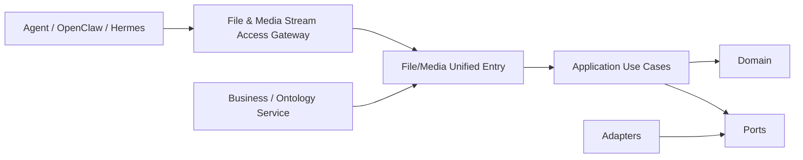
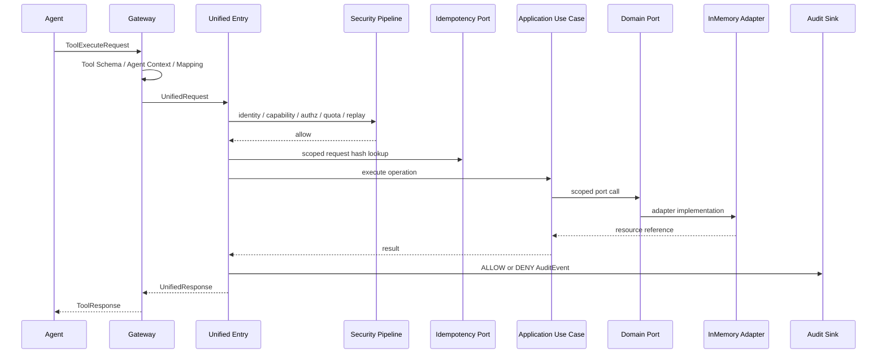
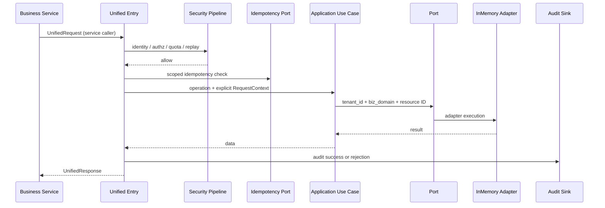
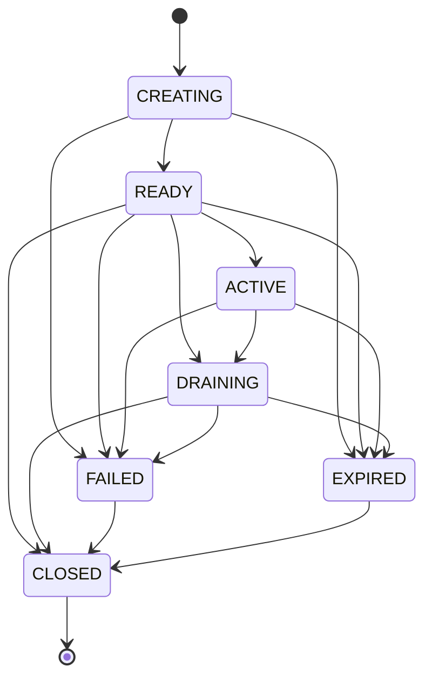

# 文件/音视频流式服务 Phase 0 架构

> 本文中的 Mermaid 均为原始架构图的派生视图；不替代最高优先级事实源
> `其他服务/文件:音视频访问服务.png`。

## 范围

Phase 0 冻结双入口、分层依赖、公共契约、领域状态机和安全管线，并用
InMemory/Fake Adapter 打通文件初始化、流会话和处理任务的控制面闭环。JSON API 不承载
文件字节或媒体帧。

非目标包括真实 PostgreSQL、Redis、MinIO、媒体服务器、OCR/ASR/转码、WebRTC 数据面、
后台 reconciliation worker 和完整生产 IAM/配额。

## 入口调用图

Gateway 只处理 Tool 协议、Schema、Agent 上下文、operation mapping 和响应包装。最终身份、
能力令牌、授权、配额、重放、幂等和审计全部在 Unified Entry 执行。

## Agent Tool 调用时序

## 业务服务调用时序

业务服务不伪装成 Agent，因而无需 Agent capability token；但不能跳过 Unified Entry 的最终
授权、配额、replay、幂等和审计。

## StreamSession 状态机

图中未列出的所有迁移均禁止，由领域方法抛出 `INVALID_STATE_TRANSITION`。重复关闭为幂等。

## 模块映射

| 架构模块 | 代码 |
|---|---|
| Gateway | `src/file_media_stream_service/gateway` |
| Unified Entry | `src/file_media_stream_service/entry` |
| Use Cases / Ports / DTO | `src/file_media_stream_service/application` |
| Entities / State / Object Key | `src/file_media_stream_service/domain` |
| InMemory/Fake integrations | `src/file_media_stream_service/adapters` |
| Identity/capability/authz/quota/replay | `src/file_media_stream_service/security` |
| Audit / redaction / structured logging | `src/file_media_stream_service/audit`, `observability` |
| Composition root only | `src/file_media_stream_service/bootstrap.py` |

所有 repository 查询以 `(tenant_id, biz_domain, id)` 为键。object key 由服务端生成，原文件名先
做 NFKC 检查、控制字符/分隔符/路径穿越拒绝和长度限制。

Phase 0 的 Reconciliation Port 对上传补偿、会话创建补偿和关闭状态分裂记录 pending recovery
状态。InMemory 实现用于验证双重失败语义；后续 PostgreSQL/Redis/outbox Adapter 提供跨进程
持久恢复和 worker 执行。
