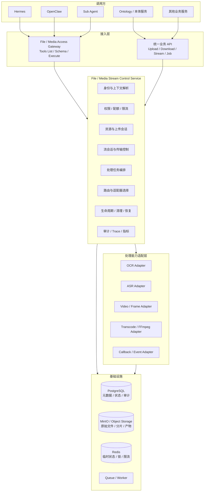

# 文件 / 音视频流式服务架构基线

> 状态：待原始压缩包架构文档复核。本文先依据已确认的总体架构固化不可随意偏离的服务边界，禁止将其直接视为最终详细设计。

## 1. 建设目标

文件 / 音视频流式服务为多租户 SaaS 平台提供统一、受控、可审计的文件、音频和视频接入、传输、存储、处理与结果访问能力。

服务需要同时支持两类调用方：

1. Hermes、OpenClaw、Sub Agent 等智能体，通过 File / Media Access Gateway 以工具协议访问；
2. Ontology、本体服务及普通业务服务，通过统一业务入口访问。

两类入口共享同一套租户隔离、资源权限、配额、审计、生命周期和底层能力，不允许形成两套互相绕过的实现。

## 2. 逻辑架构

## 3. 模块边界

### 3.1 File / Media Access Gateway

面向智能体暴露工具式能力：

- 工具发现；
- 参数 Schema；
- 工具执行；
- Agent 上下文解析；
- Tool Call 审计；
- 工具请求到领域命令的转换；
- 统一结果包装。

该网关不得直接读写 MinIO、数据库或调用 OCR/ASR 提供方。

### 3.2 统一业务 API

面向本体及业务服务提供：

- 创建资源；
- 初始化上传；
- 上传分片；
- 完成上传；
- 下载或签发受限访问地址；
- 创建实时或准实时流会话；
- 创建处理任务；
- 查询资源、任务和流状态；
- 取消任务或关闭流；
- 查询处理结果。

### 3.3 Stream Control Service

服务核心编排层负责：

- 资源和上传会话状态机；
- 音视频流会话状态机；
- 分片、断点续传、校验和去重；
- 存储路由与对象键生成；
- OCR、ASR、抽帧、转码等异步任务编排；
- 失败重试、死信、补偿和恢复；
- TTL、过期、孤儿分片与临时对象清理；
- 结果产物登记与访问控制。

### 3.4 基础设施职责

- PostgreSQL：资源元数据、会话、任务、状态流转、回调、审计索引；
- MinIO / Object Storage：原始二进制、上传分片、转码文件、OCR/ASR/抽帧等产物；
- Redis：短期会话状态、分布式锁、速率限制、幂等短缓存，不作为最终事实库；
- Queue / Worker：异步处理、重试和任务消费。

## 4. 核心领域对象

至少应包含：

- `MediaResource`：文件或媒体资源；
- `UploadSession`：分片上传会话；
- `StreamSession`：实时或准实时流会话；
- `ProcessingJob`：OCR、ASR、抽帧、转码等任务；
- `ProcessingArtifact`：处理产物；
- `AccessGrant`：受限访问授权；
- `CallbackSubscription`：回调或事件订阅；
- `AuditRecord`：操作审计。

所有对象必须携带租户和业务域边界，禁止仅依赖对象存储路径推断归属。

## 5. 推荐状态机

### 5.1 资源

`CREATED -> UPLOADING -> VERIFYING -> AVAILABLE -> PROCESSING -> READY`

异常状态：`FAILED`、`QUARANTINED`、`DELETING`、`DELETED`、`EXPIRED`。

### 5.2 上传会话

`INITIATED -> RECEIVING -> COMPLETING -> COMPLETED`

异常状态：`ABORTED`、`EXPIRED`、`FAILED`。

### 5.3 处理任务

`PENDING -> QUEUED -> RUNNING -> SUCCEEDED`

异常状态：`RETRYING`、`CANCELLED`、`FAILED`、`DEAD_LETTERED`。

任何状态变更必须校验前置状态、记录原因和操作者，并支持重复消息下的幂等处理。

## 6. 安全与租户隔离

每个资源、会话、任务和产物必须显式绑定：

- `tenant_id`；
- `biz_domain`；
- `resource_owner_id` 或业务对象标识；
- 调用者身份与权限范围。

必须满足：

- 数据库查询强制作用域过滤；
- 对象键包含不可伪造的服务端生成作用域；
- 签名 URL 短时有效、最小权限、不可跨租户复用；
- 服务端重新识别媒体类型，不信任客户端扩展名与 MIME；
- 限制单文件、分片、并发流、带宽、任务数和保留期；
- 日志禁止记录凭证、完整签名 URL、原始媒体正文和敏感识别结果；
- 删除采用可审计流程，并覆盖元数据、对象、缓存和派生产物。

## 7. 非功能要求

- 所有写操作支持幂等键；
- 上传支持断点续传和完整性校验；
- 长任务异步执行；
- 核心状态以 PostgreSQL 为事实源；
- Trace 从入口贯穿存储、队列、Worker 和外部处理提供方；
- 支持超时、重试、熔断和降级，但禁止跨租户或静默更换语义不同的处理能力；
- 支持资源清理、任务恢复、孤儿对象检测和对账；
- 公共 API 使用版本化 Schema，并执行兼容性检查。

## 8. 待原始架构包确认

收到可读取的原始压缩包后，应逐项校准：

- 原始架构图文件及目录位置；
- 服务正式命名；
- 接口协议和端点命名；
- 是否采用消息队列及具体技术；
- 实时音视频协议：WebSocket、WebRTC、RTMP、SRT 或其他；
- OCR、ASR、视频识别和转码提供方；
- 存储目录和对象键规范；
- 回调与事件总线边界；
- 保留期、配额、并发和文件大小指标；
- 与 Data Control Service、External Access Service 的调用关系。
