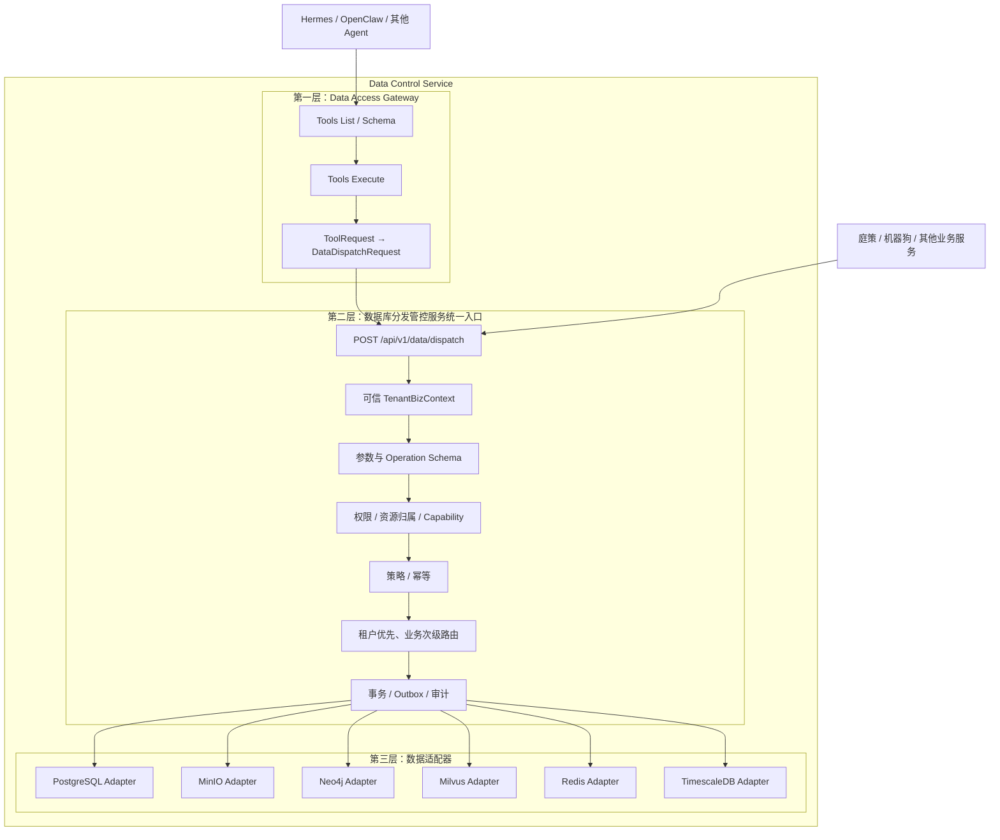

# Data Control Service

数据库分发管控服务是一个完整、独立部署的微服务。它统一承接业务服务和 Agent 的数据访问请求，并负责租户业务隔离、权限、策略、幂等、分库路由、Adapter 执行、事务、审计和统一响应。

`Data Access Gateway` 只是该服务最上层的 Agent Tool 协议入口，不是整个服务本身。

## 1. 正确架构



### Agent 路径

```text
Agent
  → Data Access Gateway
  → 数据库分发管控服务统一入口
  → Route Resolver
  → Adapter
  → 真实数据资源
```

### 业务服务路径

```text
业务本体服务
  → 数据库分发管控服务统一入口
  → Route Resolver
  → Adapter
  → 真实数据资源
```

两条路径必须在统一入口汇合，禁止分别维护两套权限、路由、幂等和审计逻辑。

## 2. 两层对外接口

### Agent Tool 层

```http
GET  /api/v1/dag/tools
GET  /api/v1/dag/tools/{tool_name}/schema
POST /api/v1/dag/tools/execute
```

主要负责 Tool 协议、Tool Schema、Agent 上下文映射以及 ToolResponse 包装。

### 数据统一入口层

```http
GET  /api/v1/data/operations
GET  /api/v1/data/operations/{operation}/schema
POST /api/v1/data/dispatch
```

统一入口同时承接 Data Access Gateway 和业务服务请求，集中完成：

```text
可信上下文建立
请求与 Operation Schema 校验
角色、Capability 和资源归属检查
策略拦截
幂等处理
租户业务路由
Adapter 执行
事务 / Outbox
访问、变更和拒绝审计
统一响应
```

## 3. 租户优先、业务次级分库

所有数据请求必须先归属租户，再归属租户下的业务：

```text
tenant_id → biz_domain → operation → resource_type → resource_id
```

路由匹配优先级：

```text
1. tenant_id + biz_domain + operation + resource_type
2. tenant_id + biz_domain + operation
3. tenant_id + biz_domain
4. tenant_id
5. 平台默认拓扑规则
```

默认规则只能选择拓扑，永远不能移除 `tenant_id + biz_domain` 数据过滤条件。

建议演进：

- 普通租户：共享实例/表，强制 `tenant_id + biz_domain`；
- 中型租户：租户 Schema，Schema 内按业务划分表；
- 大客户：租户独立 Database，Database 内按业务 Schema；
- MinIO：`tenants/{tenant_id}/{biz_domain}/...`；
- Milvus：检索阶段强制租户和业务 Scalar Filter；
- Redis：`tenant:{tenant_id}:{biz_domain}:...`；
- Neo4j/TimescaleDB 同样必须在查询执行层强制租户业务范围。

## 4. 快速扩展

目标是新增一个数据 Tool 时：

```text
新增一个可信插件文件
实现 register(registry)
声明 Tool、Action、Operation、Schema、权限和目标 Adapter
重启或重新加载后自动出现在 Tool/Operation 列表
```

禁止每新增一个 Tool 就修改核心 `switch`、API Controller 或主路由文件。

完整约束：

- [`AGENTS.md`](AGENTS.md)
- [`VIBE_CODING.md`](VIBE_CODING.md)

## 5. 当前状态

目前 `src/index.ts` 只是健康检查骨架。实现业务代码前必须先阅读本目录 `AGENTS.md`，并严格按 `VIBE_CODING.md` 的阶段推进。